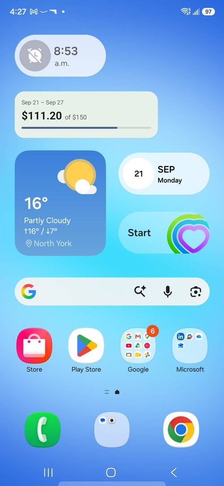
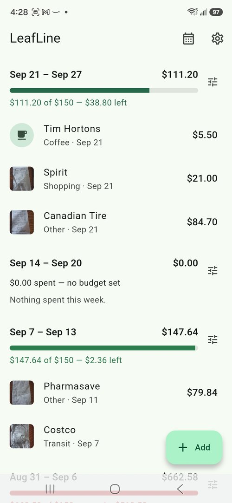
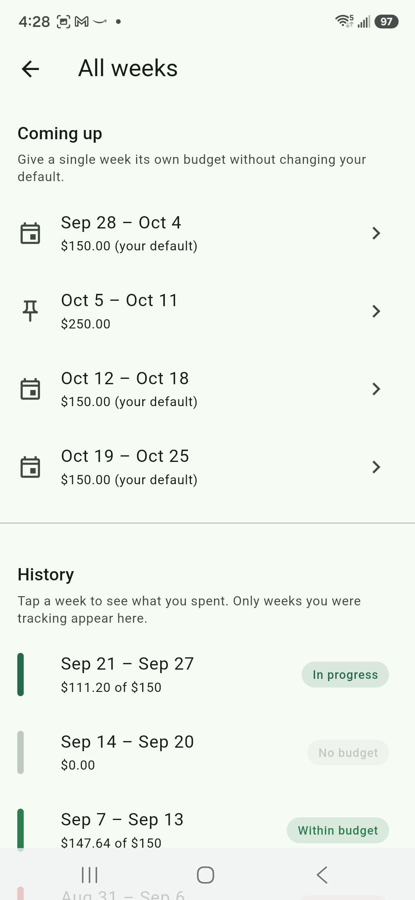
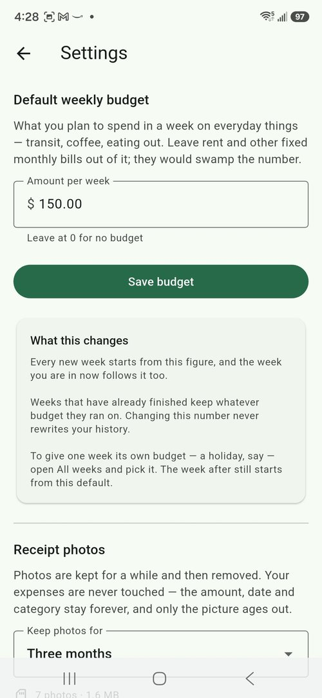
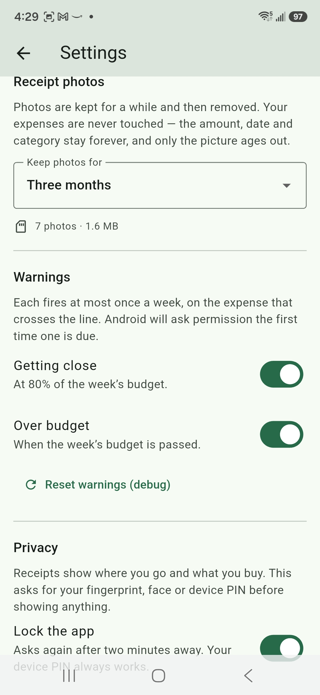
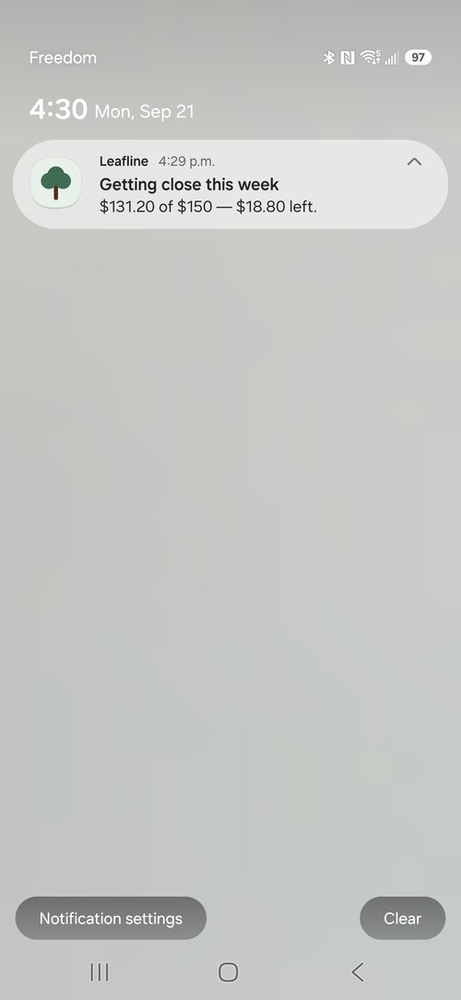

# LeafLine

<!-- Update the repo slug in these badges once the rename lands. -->
[](https://github.com/vladdyz/leafline/actions/workflows/ci.yml)


A weekly miscellaneous expense tracker for Android. Log small spending (coffee, brunch, transit, etc) by hand or by
photographing a receipt, see it grouped by week, and get warned once the
week's total approaches a budget you set.

Built almost entirely with **Flutter** except for the on-device text recognition through ML Kit and home screen widget which were developed using **Kotlin**

<table>
  <tr>
    <td align="center"><br><sub>Home screen widget</sub></td>
    <td align="center"><br><sub>Week list</sub></td>
    <td align="center"><br><sub>History</sub></td>
  </tr>
  <tr>
    <td align="center"><br><sub>Budget bar</sub></td>
    <td align="center"><br><sub>Warning settings</sub></td>
    <td align="center"><br><sub>Budget warning</sub></td>
  </tr>
</table>
---

## Why this exists

I wanted to get hands on experience using Flutter and its native Dart language to create an app that I would genuinely use and would be helpful in reinforcing good spending habits and financial literacy. Much of what defines programming is driven by self-motivated learning, and the best way to learn something new is to apply and experience it rather than solely sticking with watching tutorials and course modules. The ambition for this project was a genuinely cross-platform app, since that is a huge driving point of using the framework, but as the idea and scope of the project was defined early on in development it became clear that some features would turn out to need native code, which is why I also chose to use Kotlin as it aligned with my own personal Android device.


### Why weekly rather than monthly

The main purpose of this application is to generate awareness for small recurring expenses, which often disappear
unnoticed when planning a budget. We are often quite familiar with our large monthly expenses such as our rents and mortgages, our car payments, and our utilities, but seemingly trivial spending such as buying several coffees per day, eating out for brunches instead of packing our own meals, and taking frequent trips on public transit often fly under the radar. Collectively, these minor expenses can quickly add up and account for a significant share of our income and budget if left unchecked, and end up financially limiting us in other areas.

The decision to make it a weekly tracking app was made with the intent that it facilitates better habits. Weekly loops are shorter and easier to correct, and provide quicker and more available encouragement for staying financially disciplined. Life happens, and we may deal with sudden and unexpected expenses which may derail our progress during a month that was otherwise going well. Psychologically it is more encouraging for a user, after experiencing a bad week, to see that their habits kept them under budget for many good weeks prior, rather than the feeling that a whole month's progress and work had been lost.

That last point is a product decision with a technical consequence, and it
shapes the whole data model: see [A week exists because it has a
budget](#a-week-exists-because-it-has-a-budget).

### What it is deliberately not for

Fixed monthly obligations such as rent, car payments, insurance, and so on. Those are known,
already budgeted, and would overshadow the weekly miscellaneous expense number this app exists to
surface. There are plenty of financial planning and tracking apps available to use for this goal, and it is not the niche that this one targets. Leaving them out is the point, not an omission.

---

## Features

- **Weekly expense log** with an inline budget bar, colour and wording that
  move from under → approaching → over
- **Receipt capture** from camera or gallery, with the photo attached to the
  expense and viewable full-screen
- **On-device OCR** through ML Kit — reads the receipt and offers candidate
  totals as tappable chips. It never auto-fills: see [Why chips, not
  autofill](#why-chips-not-autofill)
- **Per-week budget overrides** for the weeks that are not like the others,
  without disturbing your standing default (enjoy your vacation week!)
- **Budget warnings** at 80% and at 100%, each firing at most once a week (supports opt out by the user) 
- **Photo retention** — photos expire on a user customized schedule (1 month, 3 months, 1 year, or indefinitely) to limit size bloat from frequent usage; the expenses
  never do
- **Optional app lock** using fingerprint, face, or device PIN
- **Home screen widget** showing the current week at a glance
- **Full history** of every tracked week, with the expenses that made it up
- Works entirely **offline**. No account, no server, no telemetry

---

## Is this a cross-platform app?

Honestly: **not quite yet.**

Flutter's promise is one codebase across platforms. Two features here needed
capabilities Flutter has no plugin for, so they went through a `MethodChannel`
to Kotlin. That makes the app Android-only *today* — but it does not undo the
cross-platform design, because every platform capability sits behind a Dart
interface rather than being called directly.

| Capability | How it is reached | iOS today |
| --- | --- | --- |
| Camera and gallery | `image_picker` | already supported |
| Documents directory | `path_provider` | already supported |
| Database | `sqflite` | already supported |
| Notifications | `flutter_local_notifications` | already supported |
| Biometric / device lock | `local_auth` | already supported |
| **Text recognition** | **custom channel → ML Kit** | **needs Swift + Vision** |
| **Home screen widget** | **custom channel → AppWidgetProvider** | **needs Swift + WidgetKit** |

**Five of seven are already cross-platform.** Only two need native iOS work.

### What an iOS port would actually take

- **One Dart file changes**: `lib/state/providers.dart`, where two
  `Platform.isAndroid` switches choose an implementation. Every screen, every
  repository, every model and every utility is untouched.
- **`OcrService`** needs a Swift implementation over Apple's Vision framework,
  answering the same channel contract — `recognizeText`, `{path}`, a list of
  `{text,left,top,width,height}`. `TotalExtractor` — the part that decides
  which number is the total — is pure Dart and would not move.
- **The widget** is the larger job, and not because of the channel: iOS
  widgets are WidgetKit and SwiftUI, a genuinely different model from
  Android's `RemoteViews`. The Dart side pushing a snapshot stays as it is.
- **A Mac.** Building and signing for iOS requires one. This is the actual
  blocker, not the code.

This is why the interfaces exist. `UnavailableOcrService` and
`UnavailableWidgetBridge` already handle the case of a platform with no
implementation — on iOS today the app would build and run, simply without
chips or a widget.

---

## Why Flutter *and* Kotlin

They share no code, and that is deliberate.

Flutter owns the UI, state, and persistence — one implementation for every
platform. Kotlin owns only what Flutter cannot reach. The line between them is
narrow on purpose: two `MethodChannel`s, each with a documented contract.

**The rule that keeps it narrow:** Kotlin returns *facts* and never *decisions*.
The OCR plugin returns recognised text and its geometry; deciding which number
on a receipt is the total happens in Dart, in `TotalExtractor`, where it can
be unit tested against fixture strings with no device involved. The widget
plugin draws finished strings; all the formatting happens in Dart.

Every line of judgement that lives in Kotlin is a line that needs an emulator
to test and a second implementation to port.

### Why not React Native, or native Android, or a web app

As stated earlier, while the current version of the app is developed for my Android phone, the long term plan is cross-platform and iOS support. Using native android would've simplified some of the OCR and widget work, but shut the door on this vision. React was a consideration, but I simply chose Flutter because it is something I wanted to understand and work with. The widget testing for Flutter is also very robust and fast - this project has 465 tests largely due to this reason.

A web app would also not be able accomplish several of the requirements set out by this app, or work offline on a phone in an area with no signal. If you put barriers and obstacles in front of a user, they will opt for the path of least resistance and not use your app to track their financial spending habits. Good habits should be made easy and accessible to reinforce them. 

---

## Architecture

```
Screens (Flutter widgets)
  └── Providers (Riverpod)
        ├── Repositories ──┬── sqflite          (expenses, budgets, settings)
        │                  └── ImageStore       (JPEGs in the documents dir)
        ├── OcrService ────[MethodChannel]── OcrPlugin (Kotlin) ── ML Kit
        ├── WidgetBridge ──[MethodChannel]── BudgetWidgetPlugin ── AppWidget
        ├── PhotoSource ─────────────────── image_picker
        ├── NotificationService ─────────── flutter_local_notifications
        └── AppLockService ──────────────── local_auth
```

Each layer talks only to the one below it. Widgets never touch sqflite;
repositories never import Flutter.

**Every platform capability is an interface with at least two
implementations** — the real one and a fake. That is not ceremony. It is what
makes 465 tests possible without a device, and it is what makes the iOS answer
above a short list rather than a rewrite.

### A week exists because it has a budget

The single most important decision in the data model, and the one everything
else follows from.

A naive design groups expenses by date and calls each group a week. That
cannot represent a week where you spent nothing — which is exactly the week
worth celebrating. It also cannot answer "what was my budget in March?"
because the budget is a single current value.

So weeks are **materialised**: a `week_budgets` row is created when a week
begins, carrying the budget in force at that moment. A week appears in your
history because it has a row, not because it has expenses.

Consequences that fall out of this:

- Changing your default budget updates the current week only, and only if that
  week has not been overridden. History is frozen.
- A week with no spending shows as *under budget*, correctly.
- A per-week override is a flag on the row, so the following week returns to
  your default automatically.

See `docs/decisions/0011` and `0012`.

### Why chips, not autofill

`TotalExtractor` scores every amount on a receipt against named, inspectable
weights — proximity to the word "total", position on the receipt, magnitude —
and penalises lines that look like a subtotal, tax, a tender line, or contact
details. Every candidate carries the reasons it scored what it did.

It is still a heuristic, and heuristics are wrong sometimes. A wrong guess
that costs one tap is an annoyance; a wrong guess silently written into the
amount field is a **wrong expense**. So the extractor offers, and you choose.

Eleven receipt fixtures pin its behaviour, including two taken from real
receipts that it originally got wrong.

---

## Tech stack

| Concern | Choice |
| --- | --- |
| UI, state, logic | Flutter (Dart 3), Material 3 |
| State management | Riverpod |
| Local database | sqflite — schema v3, three migrations |
| Photo storage | Files in the app documents directory, not blobs |
| Text recognition | ML Kit Text Recognition v2 (bundled, on-device) |
| Native layer | Kotlin — `MethodChannel`, `AppWidgetProvider`, `RemoteViews` |
| Notifications | `flutter_local_notifications` |
| Biometrics | `local_auth` |
| Testing | `flutter_test`, `sqflite_common_ffi`, `integration_test`, JUnit |
| CI | GitHub Actions — format, analyze, test, build, Kotlin tests, emulator |

### Dependencies

Dart SDK 3.13.3
Flutter SDK 3.47.4
receipt_tracker 0.5.2+1

<details>
<summary>dependencies:</summary>
- cupertino_icons 1.0.9
- flutter 0.0.0 [characters collection material_color_utilities meta vector_math sky_engine]
- flutter_local_notifications 22.3.1 [clock flutter flutter_local_notifications_linux flutter_local_notifications_windows flutter_local_notifications_web flutter_local_notifications_platform_interface timezone]
- flutter_riverpod 3.4.3 [collection flutter flutter_test meta riverpod state_notifier]
- image_picker 1.2.3 [flutter image_picker_android image_picker_for_web image_picker_ios image_picker_linux image_picker_macos image_picker_platform_interface image_picker_windows]
- intl 0.20.3 [clock meta path]
- local_auth 3.0.2 [flutter local_auth_android local_auth_darwin local_auth_platform_interface local_auth_windows]
- path 1.9.1
- path_provider 2.1.6 [flutter path_provider_android path_provider_foundation path_provider_linux path_provider_platform_interface path_provider_windows]
- sqflite 2.4.4 [flutter sqflite_android sqflite_darwin sqflite_platform_interface sqflite_common path]
- uuid 4.6.0 [crypto fixnum]
</details>

<details>
<summary>dev dependencies:</summary>
- flutter_launcher_icons 0.14.4 [args checked_yaml cli_util image json_annotation path yaml]
- flutter_lints 6.0.0 [lints]
- flutter_native_splash 2.4.8 [args flutter flutter_web_plugins html image meta path universal_io xml yaml ansicolor]
- flutter_test 0.0.0 [flutter test_api matcher path fake_async clock stack_trace vector_math leak_tracker_flutter_testing collection meta stream_channel]
- integration_test 0.0.0 [flutter flutter_driver flutter_test path vm_service]
- mocktail 1.0.5 [collection matcher test_api]
- sqflite_common_ffi 2.4.3 [sqlite3 sqflite_common synchronized path meta]
</details>

<details>
<summary>transitive dependencies:</summary>
- ansicolor 2.0.3
- archive 4.3.0 [path posix]
- args 2.7.0
- async 2.13.1 [collection meta]
- boolean_selector 2.1.2 [source_span string_scanner]
- characters 1.4.1
- checked_yaml 2.0.4 [json_annotation source_span yaml]
- cli_util 0.4.2 [meta path]
- clock 1.1.3
- code_assets 1.2.1 [collection hooks]
- collection 1.19.1
- cross_file 0.3.5+5 [meta web]
- crypto 3.0.7 [typed_data]
- csslib 1.0.2 [source_span]
- dbus 0.7.15 [args ffi meta xml]
- fake_async 1.3.3 [clock collection]
- ffi 2.2.0
- file 7.0.1 [meta path]
- file_selector_linux 0.9.4+1 [cross_file file_selector_platform_interface flutter meta]
- file_selector_macos 0.9.5+1 [cross_file file_selector_platform_interface flutter meta]
- file_selector_platform_interface 2.7.0 [cross_file flutter http plugin_platform_interface]
- file_selector_windows 0.9.3+6 [cross_file file_selector_platform_interface flutter meta]
- fixnum 1.1.1
- flutter_driver 0.0.0 [file flutter flutter_test fuchsia_remote_debug_protocol path meta vm_service webdriver matcher]
- flutter_local_notifications_linux 8.0.1 [dbus ffi flutter flutter_local_notifications_platform_interface path xdg_directories]
- flutter_local_notifications_platform_interface 12.2.0 [plugin_platform_interface timezone]
- flutter_local_notifications_web 1.0.0 [collection flutter flutter_local_notifications_platform_interface timezone web]
- flutter_local_notifications_windows 3.1.1 [flutter ffi flutter_local_notifications_platform_interface meta timezone xml]
- flutter_plugin_android_lifecycle 2.0.35 [flutter]
- flutter_web_plugins 0.0.0 [flutter]
- fuchsia_remote_debug_protocol 0.0.0 [process vm_service meta]
- glob 2.2.0 [async collection file path string_scanner]
- hooks 2.0.2 [collection crypto logging meta pub_semver record_use yaml]
- html 0.15.7 [csslib source_span]
- http 1.6.0 [async http_parser meta web]
- http_parser 4.1.2 [collection source_span string_scanner typed_data]
- image 4.10.1 [archive]
- image_picker_android 0.8.13+23 [flutter flutter_plugin_android_lifecycle image_picker_platform_interface meta]
- image_picker_for_web 3.1.1 [flutter flutter_web_plugins image_picker_platform_interface mime web]
- image_picker_ios 0.8.13+7 [flutter image_picker_platform_interface meta]
- image_picker_linux 0.2.2 [file_selector_linux file_selector_platform_interface flutter image_picker_platform_interface]
- image_picker_macos 0.2.2+1 [file_selector_macos file_selector_platform_interface flutter image_picker_platform_interface]
- image_picker_platform_interface 2.11.1 [cross_file flutter http plugin_platform_interface]
- image_picker_windows 0.2.2 [file_selector_platform_interface file_selector_windows flutter image_picker_platform_interface]
- jni 1.0.3 [args collection ffi jni_util meta package_config path plugin_platform_interface]
- jni_flutter 1.0.3 [flutter jni]
- jni_util 1.0.0 [path]
- json_annotation 4.12.0 [meta]
- leak_tracker 11.0.2 [clock collection meta path vm_service]
- leak_tracker_flutter_testing 3.0.10 [flutter leak_tracker leak_tracker_testing matcher meta]
- leak_tracker_testing 3.0.2 [leak_tracker matcher meta]
- lints 6.1.0
- listen 1.0.1 [meta]
- local_auth_android 2.2.0 [flutter flutter_plugin_android_lifecycle intl local_auth_platform_interface meta]
- local_auth_darwin 2.0.4 [flutter intl local_auth_platform_interface meta]
- local_auth_platform_interface 1.1.0 [flutter plugin_platform_interface]
- local_auth_windows 2.0.2 [flutter local_auth_platform_interface meta]
- logging 1.3.0
- matcher 0.12.20 [async meta stack_trace term_glyph test_api]
- material_color_utilities 0.13.0 [collection]
- meta 1.18.3
- mime 2.1.0
- native_toolchain_c 0.19.2 [code_assets glob hooks logging meta pub_semver]
- objective_c 9.5.0 [code_assets collection ffi hooks logging meta pub_semver]
- package_config 3.0.0 [meta]
- path_provider_android 2.3.1 [flutter jni jni_flutter path_provider_platform_interface]
- path_provider_foundation 2.6.0 [ffi flutter objective_c path_provider_platform_interface]
- path_provider_linux 2.2.2 [ffi flutter path path_provider_platform_interface xdg_directories]
- path_provider_platform_interface 2.1.3 [flutter platform plugin_platform_interface]
- path_provider_windows 2.3.0 [ffi flutter path path_provider_platform_interface]
- petitparser 7.0.2 [meta collection]
- platform 3.2.0 [meta]
- plugin_platform_interface 2.1.8 [meta]
- posix 6.5.2 [ffi meta path]
- process 5.0.6 [file path platform]
- pub_semver 2.2.1 [collection]
- record_use 0.6.0 [collection meta pub_semver]
- riverpod 3.4.3 [async clock collection listen meta stack_trace state_notifier test_api uuid]
- sky_engine 0.0.0
- source_span 1.10.2 [collection path term_glyph]
- sqflite_android 2.4.4 [flutter sqflite_common path sqflite_platform_interface]
- sqflite_common 2.5.13 [synchronized path meta]
- sqflite_darwin 2.4.4 [flutter sqflite_platform_interface meta sqflite_common path]
- sqflite_platform_interface 2.4.2 [flutter platform sqflite_common plugin_platform_interface meta]
- sqlite3 3.5.2 [collection ffi meta path web typed_data hooks code_assets native_toolchain_c crypto]
- stack_trace 1.12.2 [path]
- state_notifier 1.0.0 [meta]
- stream_channel 2.1.4 [async]
- string_scanner 1.4.1 [source_span]
- sync_http 0.3.1
- synchronized 3.4.2
- term_glyph 1.2.2
- test_api 0.7.12 [async boolean_selector collection meta source_span stack_trace stream_channel string_scanner term_glyph]
- timezone 0.11.1 [http path]
- typed_data 1.4.0 [collection]
- universal_io 2.3.1 [collection meta typed_data]
- vector_math 2.4.0
- vm_service 15.3.0
- web 1.1.1
- webdriver 3.2.0 [matcher path stack_trace sync_http web]
- xdg_directories 1.1.0 [meta path]
- xml 7.0.1 [collection meta petitparser]
- yaml 3.1.4 [collection source_span string_scanner]
</details>
---

## Getting started

**Requires:** Flutter SDK on `PATH`, Android SDK, JDK 21.

```bash
git clone https://github.com/vladdyz/leafline.git
cd leafline
flutter pub get
flutter run
```

Android-only. `flutter run` needs a connected device or a running emulator.

### Release build

Signing keys never enter the repository (`docs/decisions/0005`). To build a
signed release you need your own keystore and an `android/key.properties`
pointing at it — see [`RELEASE.md`](./RELEASE.md).

```bash
flutter build apk --release
```

---

## Developer workflow

Four commands, in this order, before every push:

```bash
dart format .                      # fails CI if not run
flutter analyze --fatal-infos      # infos are deliberately errors here
flutter test                       # 465 tests
flutter test integration_test      # needs a device; see the warning below
```

Plus the Kotlin side:

```bash
cd android && ./gradlew :app:testDebugUnitTest    # 10 JUnit tests
```

A pre-commit hook in `hooks/` runs the formatter check. CI runs all of it.

> **`flutter test integration_test` wipes the app's data.** It installs a test
> harness alongside the app, and mismatched signatures force an uninstall
> first — which takes the database and every receipt photo with it. Run it
> against an emulator and not the install you actually use (unless you want a clean app!).

### `--fatal-infos` is not excessive

Dart's *info*-level diagnostics include deprecations and inference hazards
that become errors in a later SDK. Treating them as failures means the
codebase never accumulates a backlog of "we'll fix that later". It has caught
a deprecated constructor parameter, a redundant import, and a genuine type
inference trap in `fold` that produced valid-looking code meaning the wrong
thing.

---

## Testing

**465 Dart tests, 10 Kotlin tests, 83.0% line coverage** (1,600 / 1,928).

The distribution matters more than the number:

| Layer | Coverage | |
| --- | --- | --- |
| `lib/util` — pure logic | **100%** | money, week maths, budget rules |
| `lib/state` | 89.2% | providers |
| `lib/data` | 86.9% | repositories, database, image store |
| `lib/ui` — widgets | 87.2% | |
| `lib/ui` — screens | 82.4% | |
| `lib/models` | 81.8% | |
| `lib/services` | 65.8% | see below |

`lib/services` is low **because of the architecture**. The
files at 0–40% are the thin real implementations behind the platform
interfaces — `local_notification_service.dart` (0%), `channel_ocr_service.dart`
(20%), `app_lock_service.dart` (38%). They cannot run without a device. What
they wrap is tested through fakes, and the logic that matters:
`budget_alert_service.dart`, `photo_retention_sweeper.dart`,
`widget_snapshot_builder.dart` — is at **100%**.

* main.dart and lock_screen.dart are excluded (flutter test only measures files it loads, and nothing in the unit suite imports either). The true figure across all of lib/ is therefore slightly below 83.0%.


### What the tests actually do

- **Unit tests** over the extractor (11 receipt fixtures), week maths, money
  formatting, budget rules, retention windows, alert thresholds.
- **Repository tests** against real SQLite through `sqflite_common_ffi`, not
  mocks — including every migration path.
- **Widget tests** driving real screens with fake platform services.
- **Hostile-data tests** — 500-character merchant names, `$999,999.99` weeks,
  100 expenses in one week, emoji and RTL text, a week spanning New Year.
- **Accessibility tests** — every screen at 130% and 200% text scale, tap
  target sizes, screen-reader labels, contrast.
- **Integration tests** on a real device, proving the parts every other test
  substitutes away: real `path_provider`, real sqflite, real migrations.

### Coverage report

```bash
flutter test --coverage        # writes coverage/lcov.info
```


---

## Accessibility

Tested against **WCAG 2.2 AA criteria**, adapted for a native app.

Being precise about the standard, because the honest position is narrower than
most claims: AODA covers public-facing *websites*, WCAG is written for web
content, and EN 301 549 binds EU public-sector procurement. **Nothing legally
binds this app.** WCAG 2.2 AA is used as a reference alongside Android's own
expectations — TalkBack, 48dp targets, honouring the system font scale.

Four checks run in CI on every push:

| Check | Catches |
| --- | --- |
| Render at 130% and 200% text scale | A `Row` overflows by *throwing*, so this is a real assertion |
| `androidTapTargetGuideline` | Anything under 48×48dp |
| `labeledTapTargetGuideline` | A tappable with nothing to announce |
| `textContrastGuideline` | Contrast, against rendered pixels |

The text-scale tests found two genuine bugs on their first run — a date field
and a dropdown that both overflowed at 130%, invisible at the default size and
broken for exactly the users who most need them not to be.

**What this does not prove:** that the app is usable with TalkBack. Screen
reader behaviour needs a screen reader and a person who relies on one. What it
proves is that the conditions under which it becomes unusable are absent.

See `docs/decisions/0021`.

---

## Data, privacy and support

**Where your data lives.** One SQLite database and a folder of JPEGs, both in
the app's private directory on the device. Nothing leaves the phone. No
account, no server, no analytics, no crash reporting.

**Will an update delete my data?** No. The schema is versioned and migrations
run in order on open — v1 → v2 added per-week budgets and backfilled existing
weeks, v2 → v3 added a settings table. Each migration is covered by tests that
open a database at the old version and assert the data survives.

**Will clearing app data delete my expenses?** **Yes, permanently.** Android's
"Clear storage" removes the app's private directory, and with no backup and no
sync there is nothing to restore from. This is the real cost of
[decision 0004](docs/decisions/) — no accounts means no recovery. Uninstalling
does the same.

**Photos expire, expenses do not.** Photos are removed on the retention
schedule you choose (three months by default). The amount, date, category and
recognised text are kept permanently. An expense whose photo has expired shows
a placeholder, not a broken record.

**Security posture.** The database is not encrypted. Android's app sandbox
already prevents other apps reading it, and on a non-rooted device that is the
real boundary — a local password would protect nothing that the sandbox does
not already. The optional app lock guards exactly one threat: someone picking
up your unlocked phone. See `docs/decisions/0004` and `0018`.

---

## Design decisions

Twenty-one short records in [`docs/decisions/`](./docs/decisions), one per
choice, written the day it was made.

| | |
| --- | --- |
| 0001 | Money is stored as integer cents |
| 0002 | Receipt photos are files on disk, not database blobs |
| 0003 | Total extraction lives in Dart, not Kotlin |
| 0004 | No user accounts in v1 |
| 0005 | Signing keys never enter the repository |
| 0006 | Photos expire; expenses do not |
| 0007 | Local notifications only; no SMS or email |
| 0008 | FFI for repository tests |
| 0009 | A change stream, not reactive queries |
| 0010 | The database is opened at startup |
| 0011 | A week exists because it has a budget |
| 0012 | One write path for the default budget |
| 0013 | Extractor scoring is inspectable |
| 0014 | Photo lifecycle: id at form-open, delete ≠ delete photo |
| 0015 | The channel name is a plain literal on both sides |
| 0016 | The post-OCR re-encode is dropped |
| 0017 | A warning fires on the write that crosses the line |
| 0018 | The app lock is offered, not imposed |
| 0019 | The widget renders a snapshot, not a query |
| 0020 | The orphan sweep has a grace period |
| 0021 | Accessibility is tested, not asserted |

---

## Known limitations

- **Android only.** See [the cross-platform section](#is-this-a-cross-platform-app).
- **Extraction is heuristic.** Right on all eleven fixtures and on the real
  receipts tested, but it will be wrong sometimes. That is why it offers
  rather than fills.
- **ML Kit does not read inverted text.** A total printed white-on-black (as
  Costco does) is not recognised. Including more of the receipt usually gives
  the extractor another copy of the figure to find.
- **No sync, no backup, no export.** One device. Clearing app data loses
  everything.
- **One photo per expense**, and it is optional.
- **One currency.**
- **No scheduled weekly summary.** Designed, deferred, and not built as it
  needs timezone handling and exact-alarm permissions that did not justify
  themselves.

---

## What went wrong along the way

The bugs worth recording, because they were all more interesting than the
features.

- **A test that passed for several build phases by coincidence.** The settings screen
  saved the default budget using the wall clock rather than the injected one.
  The test pinned a date in the same calendar week as the day it was written,
  so the write landed on the right row by accident. It failed the first time
  CI ran after 8pm Toronto time, when the UTC runner had already crossed into
  the next week. Now pinned to 2031, where no real clock can ever agree.
- **The orphan sweep ate photos mid-attachment.** The app lock chose between
  its lock screen and its child with a ternary, which destroys and rebuilds
  the element, re-running the startup tasks on every unlock. Adding an expense with a photo
  longer than the lock's grace window resulted in the just-taken photo being swept as it was not yet associated with the expense.
  Fixed by moving the lock above the Navigator and giving the sweep a one-hour
  grace period, so it is safe *whenever* it runs rather than safe because of
  when it runs.
- **A phantom amount over $100 that appeared nowhere on the receipt.**
  `905.555.0143` contains `905.55`. Amounts are now rejected when the adjacent
  character is a digit or a dot.
- **Real file I/O does not complete inside a widget test.** `testWidgets` runs
  in a fake clock; `dart:io` writes complete on an event loop it never pumps.
  Solved by making `ImageStore` an interface with an in-memory implementation
  — the same pattern as every other platform boundary.
- **Two `Row` overflows found by the accessibility tests**, both invisible at
  the default font size.

The most difficult part personally was the new syntax. Dart is close enough to JS and building web apps that the fundamentals were still the same, but also different enough to sometimes be confusing and misleading. Tracking the flow
of logic across dozens of files as the application expanded in size and knowing what each one was responsible for was
a major challenge. This is a large part of why the decision records and [`technical documentation`](./TECHNICAL.md) exist: they are as much for me as anyone else who happens to read this! 


---

## Roadmap

| Phase | Delivers | |
| --- | --- | --- |
| 0 | Skeleton, utilities, CI | done |
| 1 | Data layer with tests, no UI | done |
| 2 | Manual entry, week list, budget bar | done |
| 2.5 | Per-week budgets, history | done |
| 3 | Camera, Kotlin OCR channel, amount chips | done |
| 4 | Retention, notifications, app lock, release config | done |
| 5 | Home screen widget | done |

### Possible future work

- [x] Close the coverage gaps
- [ ] Scheduled Monday summary notification
- [ ] The growing-canopy visual identity (a `CustomPainter` that fills in
      across the week and resets Monday) - giving the user a nice and encouraging visual to reward their savings
- [ ] CSV export — the obvious answer to "no backup"
- [ ] iOS: Swift `OcrPlugin` over Vision, WidgetKit widget
- [ ] Per-category budgets
- [ ] Database encryption via `sqflite_sqlcipher`

---

## Further reading

- [`TECHNICAL.md`](./TECHNICAL.md) — every file and what it is responsible for,
  the schema, the channel contracts, the test matrix
- [`docs/decisions/`](./docs/decisions) — twenty-one decision records
- [`RELEASE.md`](./RELEASE.md) — signing and release build
