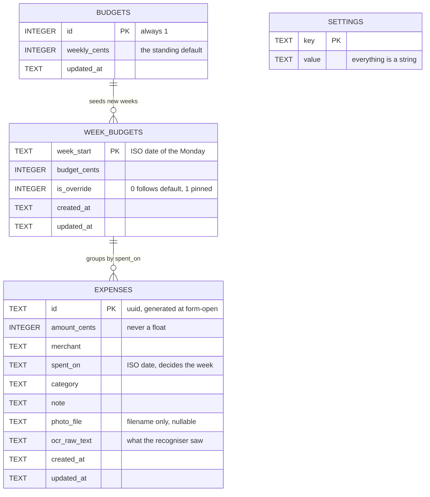
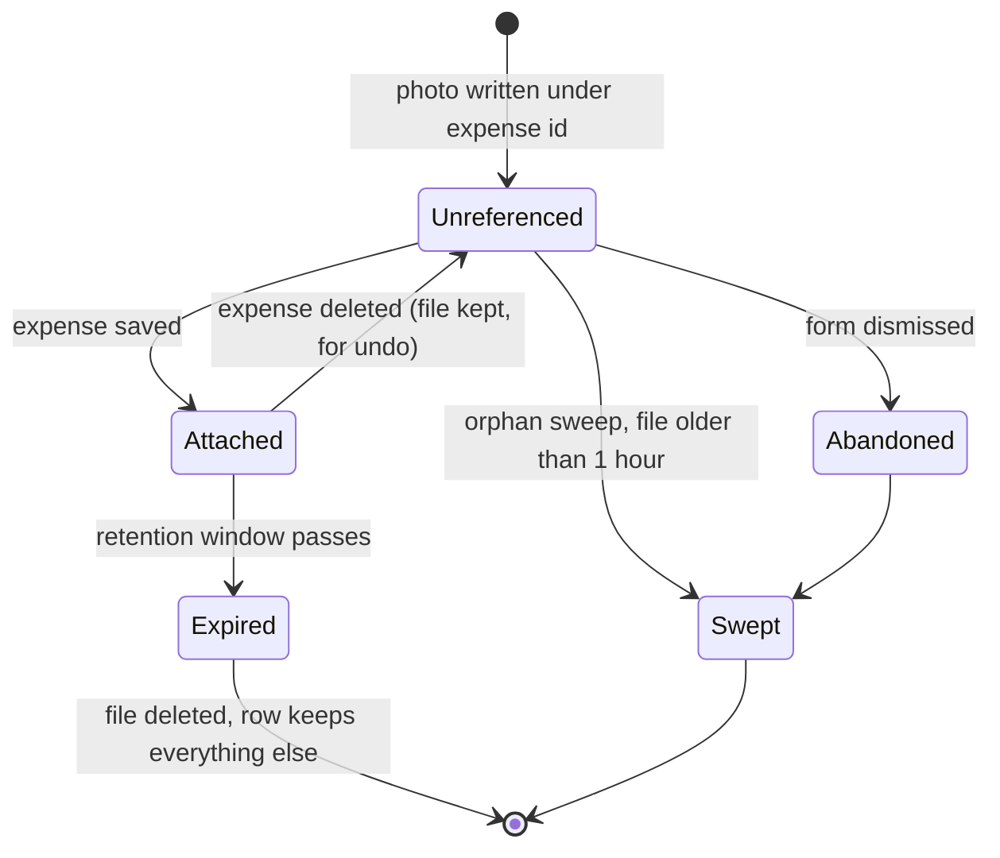
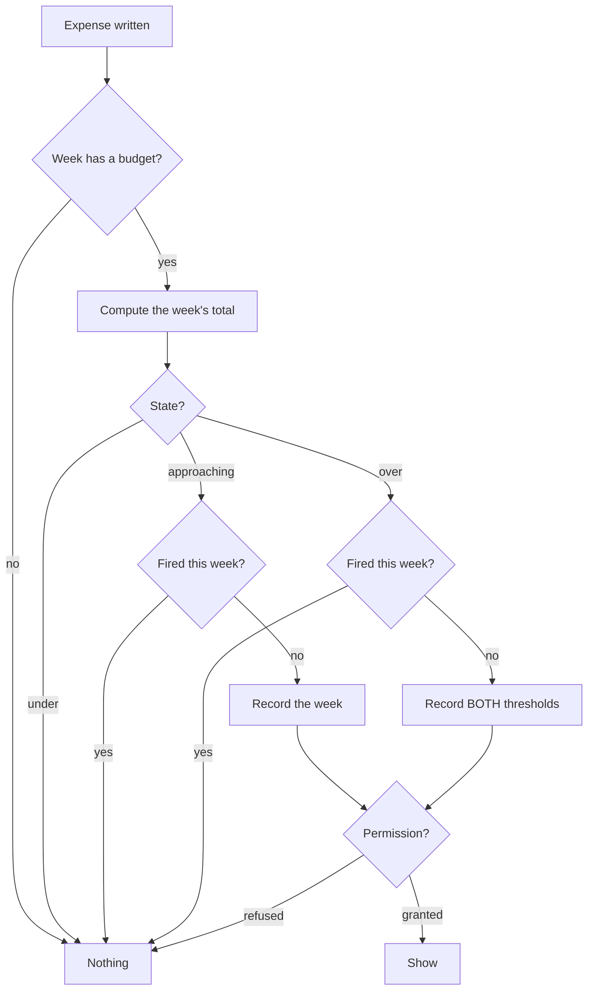

# LeafLine — Technical Documentation

Companion to [`README.md`](./README.md). The README says what the app does and
why it exists. This says how it is put together, file by file, and why each
piece is shaped the way it is.

**Contents**

1. [Architecture and the layer rule](#1-architecture-and-the-layer-rule)
2. [Data model](#2-data-model)
3. [The Dart codebase, file by file](#3-the-dart-codebase-file-by-file)
4. [The Kotlin codebase, file by file](#4-the-kotlin-codebase-file-by-file)
5. [Channel contracts](#5-channel-contracts)
6. [Configuration files](#6-configuration-files)
7. [Key flows](#7-key-flows)
8. [Test strategy](#8-test-strategy)
9. [Build, CI and release](#9-build-ci-and-release)
10. [Version history](#10-version-history)
11. [What ML Kit actually is](#11-what-ml-kit-actually-is-and-what-we-can-know-about-it)

---

## 1. Architecture and the layer rule

```
┌─────────────────────────────────────────────────────────┐
│  Screens & widgets            lib/ui/                   │
│    Flutter. Knows about providers. Never about SQL.     │
├─────────────────────────────────────────────────────────┤
│  Providers                    lib/state/providers.dart  │
│    Riverpod. Wires everything and chooses platform      │
│    implementations. The one file iOS would change.      │
├──────────────────────┬──────────────────────────────────┤
│  Repositories        │  Services                        │
│  lib/data/           │  lib/services/                   │
│    sqflite + files.  │    Platform boundaries, each an  │
│    Never imports     │    interface with a real and a   │
│    Flutter.          │    fake implementation.          │
├──────────────────────┴──────────────────────────────────┤
│  Models & utilities   lib/models/, lib/util/            │
│    Pure Dart. No I/O, no Flutter, no platform. 100%     │
│    covered, because nothing stops it being.             │
└─────────────────────────────────────────────────────────┘
                            │
                     MethodChannel ×2
                            │
┌─────────────────────────────────────────────────────────┐
│  Kotlin              android/.../ocr/, .../widget/      │
│    Returns facts, never decisions.                      │
└─────────────────────────────────────────────────────────┘
```

### The two rules that hold it together

**Each layer talks only to the one below it.** A screen never touches sqflite.
A repository never imports Flutter — which is testable, and tested: a
repository that imported `material.dart` could not run in a plain `test()`,
and every repository test is a plain `test()`.

**Kotlin returns facts, never decisions.** The OCR plugin returns recognised
text and its geometry; *which number is the total* is decided in Dart. The
widget plugin draws finished strings; all formatting happens in Dart.

That second rule is the one that pays for itself. Every line of judgement
living in Kotlin is a line needing an emulator to test and a second
implementation to port. `TotalExtractor` is 90 lines of scoring logic with 11
fixtures — in Kotlin it would need a device to test and a Swift rewrite for
iOS. In Dart it needs neither.

### Every platform capability is an interface

| Interface | Real | Fake / fallback |
| --- | --- | --- |
| `OcrService` | `ChannelOcrService` | `StubOcrService`, `UnavailableOcrService`, `FakeOcrService` |
| `PhotoSource` | `ImagePickerPhotoSource` | `UnavailablePhotoSource`, `FakePhotoSource` |
| `NotificationService` | `LocalNotificationService` | `UnavailableNotificationService`, `FakeNotificationService` |
| `AppLockService` | `LocalAuthAppLockService` | `UnavailableAppLockService` |
| `WidgetBridge` | `ChannelWidgetBridge` | `UnavailableWidgetBridge` |
| `ImageStore` | `FileImageStore` | `InMemoryImageStore` |
| the clock | `DateTime.now` via `nowProvider` | any pinned `DateTime` |

This is not ceremony. It is what makes 434 tests runnable with no device, and
it is why the iOS answer in the README is a two-item list rather than a
rewrite.

`ImageStore` became an interface late, and for a specific reason:
`testWidgets` runs inside a fake clock, and `dart:io` writes complete on an
event loop that clock never pumps. A widget test that saved a photo waited
forever on a future that could not resolve. See `docs/decisions/0008` for the
same problem solved differently at the database layer.

---

## 2. Data model

### Entity relationships



There are no foreign keys. An expense belongs to a week because its
`spent_on` falls inside it, computed by `weekStart()`. That is deliberate:
the relationship is derivable from a date, and storing it too would create a
second source of truth that could disagree with the first.

### Why a week is a row

The central decision (`docs/decisions/0011`), and everything else follows.

A naive design groups expenses by date. That cannot represent a week where
you spent nothing — the week worth celebrating — and cannot answer "what was
my budget in March?", because the budget is a single current value.

So weeks are **materialised**. A `week_budgets` row is written when a week
begins, carrying the budget in force at that moment.

| Consequence | Mechanism |
| --- | --- |
| History is frozen | `setDefaultWeeklyCents` updates only the current week, and only where `is_override = 0` |
| An empty week reads as *under budget* | The row exists with a budget and no expenses |
| An override lasts exactly one week | `is_override = 1` on that row; the next week is seeded fresh from `budgets` |

### The `settings` table is deliberately untyped

Key and value, both `TEXT`. Every value is parsed by `SettingsRepository`,
which means adding a preference needs no migration. Four have been added
since — photo retention, two alert toggles, the app lock — with no schema
change at all.

### Migrations

| Version | Change | Backfill |
| --- | --- | --- |
| 1 | `expenses`, `budgets` | — |
| 2 | `week_budgets` | Creates a row for every week that already had expenses, at the current default |
| 3 | `settings` | **None.** An absent key reads as its default, so an upgraded install behaves exactly like a fresh one |

The v3 decision to seed nothing is worth noting: it means the default value
can change in a later release without a second migration to correct rows
written by the first.

Every migration has a test that opens a database at the old version, runs the
upgrade, and asserts existing data survived.

---

## 3. The Dart codebase, file by file

40 files. Coverage figures are from `coverage/lcov.info`.

### `lib/util/` — pure logic, 100% covered

No I/O, no Flutter, no platform. This is where anything that can be a pure
function is one, and the coverage is 100% because nothing prevents it.

| File | Responsibility |
| --- | --- |
| `money.dart` | Parse and format money. `parseAmountToCents` accepts what people actually type — `$12`, `12.5`, `1,234.56` — and returns integer cents or null. `formatCents` is the single place money becomes a string; `formatCentsCompact` drops `.00` for budgets. |
| `week_math.dart` | `weekStart()` — the Monday of any date — plus ISO date parsing and formatting. Every week boundary in the app comes from here. |
| `budget_rules.dart` | `BudgetState` (under / approaching / over), `budgetStateFor`, `budgetMessage`, `WeekOutcome` for finished weeks, and `kApproachingPercent = 80`. The one place a threshold is defined. |
| `bytes.dart` | `formatBytes`, `formatPhotoCount` for the storage line in Settings. |

**Why `budgetStateFor` treats *exactly at budget* as over.** Spending your
last dollar means the next purchase puts you over, and a live week should say
so. A *finished* week at exactly its budget is `WeekOutcome.under` — it
succeeded. The same number, read differently depending on whether the week can
still change.

### `lib/models/` — data shapes

| File | Coverage | Responsibility |
| --- | --- | --- |
| `expense.dart` | 97.2% | The expense. `Expense.create` generates timestamps; `copyWith` has explicit `clearPhoto` / `clearOcrText` flags because null means "unchanged" otherwise. `toMap`/`fromMap` are the only place column names appear outside repositories. |
| `week_budget.dart` | 47.4% | One materialised week. `hasBudget`, `weekEndDate`. |
| `budget.dart` | 68.0% | The standing default. `Budget.unset()` is the zero state. |
| `ocr_block.dart` | 87.8% | A recognised block of text and its box, `fromChannel` for the Kotlin payload, and `groupIntoLines` — which rejoins blocks the recogniser split, so `TOTAL` and `7.06` end up on one line. |
| `photo_retention.dart` | **100.0%** | The retention enum. `cutoffFrom` uses calendar arithmetic — "three months ago" is the same day three months back, which `DateTime` normalises across year boundaries for free. `fromId` falls back rather than throwing on an unknown value. |
| `budget_alert.dart` | **100.0%** | `BudgetAlert` plus `pendingBudgetAlert`, the pure rule deciding which warning (if any) a write warrants. Storage, notification and recording all happen elsewhere so this can be tested exhaustively. |

### `lib/data/` — persistence, 86.9%

Never imports Flutter.

| File | Coverage | Responsibility |
| --- | --- | --- |
| `database.dart` | 53.2% | Opens sqflite, holds the schema version and table names, runs the migration ladder. The low figure is the migration paths, exercised by tests that construct old databases directly. |
| `expense_repository.dart` | 89.7% | CRUD over `expenses`, week totals, `photoFilesOlderThan`, `referencedPhotoFiles`, `clearPhotosOlderThan`. Exposes a `changes` stream rather than reactive queries (`docs/decisions/0009`). |
| `week_budget_repository.dart` | 90.4% | The only writer of the default budget (`docs/decisions/0012`). Materialises weeks, applies and clears overrides, and enforces the rule that a default change touches the current week only when not overridden. |
| `settings_repository.dart` | **100.0%** | Typed accessors over the untyped `settings` table. Every getter has a default and none throw on a missing or malformed value. |
| `image_store.dart` | **100.0%** | The `ImageStore` interface and `FileImageStore`. Writes JPEGs named by expense id, deletes, lists, sizes, and sweeps orphans — with a one-hour grace period so it is safe whenever it runs, not merely when it is currently called (`docs/decisions/0020`). |

### `lib/services/` — platform boundaries, 65.8%

Low by design. The files at 0–40% are the thin real implementations that
cannot run without a device; what they wrap is tested through fakes.

| File | Coverage | Responsibility |
| --- | --- | --- |
| `total_extractor.dart` | 88.9% | Scores every amount on a receipt against named weights and returns ranked candidates, each carrying the reasons it scored what it did (`docs/decisions/0013`). Rejects amounts adjacent to a digit or dot — a phone number contains `905.55`. |
| `ocr_service.dart` | 88.2% | The `OcrService` interface, `OcrFailure`, `UnavailableOcrService`, and `stubReceiptBlocks` — a fake corner-shop receipt with decoys. |
| `channel_ocr_service.dart` | 20.0% | The Dart half of the OCR channel. Converts `PlatformException` to `OcrFailure`, and turns `MissingPluginException` into a message naming the channel and pointing at `MainActivity`. |
| `photo_source.dart` | 57.9% | `PhotoSource` over `image_picker`, with `PhotoFailure` distinguishing a refused permission from a cancelled pick. |
| `notification_service.dart` | 16.7% | The interface and the do-nothing implementation. |
| `local_notification_service.dart` | 0.0% | `flutter_local_notifications`: channel creation, the Android 13 permission request, showing and cancelling. Entirely untestable off-device, which is exactly why it holds no logic. |
| `budget_alert_service.dart` | **100.0%** | Reads the week, applies `pendingBudgetAlert`, records the fired week **before** showing, and notifies. The ordering is deliberate: a refused permission still counts as fired, so a denied prompt is not re-raised on the next expense (`docs/decisions/0017`). |
| `photo_retention_sweeper.dart` | **100.0%** | Expires photos past the retention window. Reads filenames → nulls rows → deletes files, in that order, because dying mid-way leaves collectable orphans rather than rows pointing at missing files. |
| `app_lock_service.dart` | 38.5% | `shouldLock` (pure, tested) plus `local_auth`. `biometricOnly: false` is the important line — with no account and no backend there is no recovery path, so the device PIN must always work. |
| `widget_bridge.dart` | 47.1% | `WidgetSnapshot` and the channel that pushes it. Swallows channel failures: the widget is a convenience surface, the app is the source of truth. |

### `lib/state/providers.dart` — 87.4%

Every provider, the `WeekView` / `WeekSummary` view models, and the two
`Platform.isAndroid` switches that pick OCR and widget implementations.

**This is the only file an iOS port would change.**

It also holds `_refreshOnAnyWrite`, which subscribes derived providers to the
repositories' change streams — one place where "something changed, recompute"
is expressed, rather than each provider remembering to.

### `lib/ui/` — screens and widgets

| File | Coverage | Responsibility |
| --- | --- | --- |
| `theme.dart` | 94.1% | Material 3 from the seed `#3F6B52`, plus `HarvestTheme.money()` — tabular figures, so amounts in a column line up. |
| `main.dart` | *not measured* | App entry. Opens the database, builds `ProviderScope` with the real implementations, and hosts `_AppLockGate` (via `MaterialApp.builder`, so it covers pushed routes) and `_StartupTasks` (materialise the current week, sweep expired photos, sweep orphans, initialise notifications, push the widget snapshot). |
| `screens/week_list_screen.dart` | 69.4% | The home screen. Four most recent weeks, each with a budget bar and its expenses, swipe-to-delete with undo. |
| `screens/expense_form_screen.dart` | 86.6% | Add and edit. Owns the photo lifecycle, runs OCR, shows candidate chips, warns when a date change moves the expense to another week, and deletes with undo. The largest file, and the one that touches the most services. |
| `screens/settings_screen.dart` | 80.3% | Default budget, photo retention, storage usage, the two alert toggles, the app lock, and a debug-only warning reset. |
| `screens/all_weeks_screen.dart` | 88.3% | Upcoming weeks (budget planning) and history (tap to open). |
| `screens/week_detail_screen.dart` | 87.5% | One week in full: budget bar, outcome chip, every expense in that week, tap to edit. |
| `screens/lock_screen.dart` | *not measured* | Deliberately blank of content. A blur that survives a screenshot is decoration, not a lock. |
| `widgets/budget_bar.dart` | **100.0%** | The progress bar and its sentence, wrapped in `Semantics` so a screen reader hears the sentence rather than a percentage. |
| `widgets/expense_tile.dart` | 89.1% | One expense row, plus `WeekHeader` and `OutcomeChip`. |
| `widgets/receipt_photo.dart` | 66.1% | Thumbnail, full-screen viewer, and the form's photo field. |
| `widgets/amount_chips.dart` | 69.0% | OCR candidates as chips. Renders nothing at all when there are none — a failed recognition, an unreadable receipt and a platform without OCR should look identical, because in every case you type the amount. |
| `widgets/week_budget_sheet.dart` | **100.0%** | Per-week override sheet — the vacation-week control. Opened directly in tests rather than through the screens that launch it. |
| `widgets/widget_snapshot_builder.dart` | **100.0%** | Turns a week into the strings the home screen widget shows. Takes plain values rather than a view model, so it is not coupled to whichever provider feeds it. |

> **Why `main.dart` and `lock_screen.dart` show no coverage.** `flutter test`
> only instruments files it loads, and nothing in the unit suite imports
> either — `main.dart` is loaded by the integration test, which runs
> separately. So the real figure across all of `lib/` is slightly below 76.2%.
> Said plainly here rather than left to imply otherwise.

---

## 4. The Kotlin codebase, file by file

Six files. Everything else Android-side is resources or configuration.

| File | Responsibility |
| --- | --- |
| `MainActivity.kt` | Extends **`FlutterFragmentActivity`**, not `FlutterActivity` — `local_auth` shows its prompt as a `DialogFragment`, and with a plain `FlutterActivity` the prompt never appears and nothing errors. Registers both plugins on the engine's messenger with `applicationContext`, so neither outlives a destroyed Activity. |
| `ocr/OcrPlugin.kt` | The OCR channel handler. Validates the path, hands the file to ML Kit, maps the result. Every path ends in exactly one `result.success` or `result.error` — a channel that never replies leaves the Dart future pending forever, which presents as a spinner that never stops and no error anywhere. |
| `ocr/ReceiptTextMapper.kt` | Converts ML Kit's `Text` into channel maps. Flattens to **lines**, not blocks: a `TextBlock` is a paragraph, and on a two-column receipt one block can span several rows, gluing unrelated amounts into one string. |
| `ocr/ReceiptBlocks.kt` | The pure part — builds one map from text and four integers. **Holds no Android types**, which is the entire reason its tests are plain JVM tests with no Robolectric and no emulator. |
| `widget/BudgetWidgetPlugin.kt` | Receives the snapshot from Dart, writes it to `SharedPreferences`, asks every placed widget to redraw. |
| `widget/BudgetWidgetProvider.kt` | The `AppWidgetProvider`. Reads the snapshot and renders `RemoteViews`. Never queries anything — before the app has run, the layout's own defaults show, which read as "open the app" rather than as zeroes that look like real figures. |

### Why `ReceiptBlocks` is separate from `ReceiptTextMapper`

`ReceiptTextMapper` touches `com.google.mlkit` and `android.graphics.Rect`.
`ReceiptBlocks` touches neither, and holds every decision worth testing — what
counts as empty, what a negative bounding box means, which keys the contract
names.

That split is why `ReceiptBlocksTest` runs in milliseconds on a CI runner with
no Android SDK loaded. Ten tests, and they are the only Kotlin logic that
could be got wrong.

### Android resources

| File | Purpose |
| --- | --- |
| `res/layout/budget_widget.xml` | The widget layout. **`RemoteViews` supports a small fixed set of views** — LinearLayout, FrameLayout, RelativeLayout, TextView, ImageView, ProgressBar, Button. `ConstraintLayout` is not among them, and an unsupported view fails at inflate time *on the home screen*, with nothing in the app's logs. |
| `res/xml/budget_widget_info.xml` | Widget metadata: size, resize behaviour, preview. `updatePeriodMillis="0"` because updates are pushed, not polled. |
| `res/values/widget.xml` | Widget colours and empty-state strings. Every colour clears 4.5:1 against the background. |
| `res/drawable/widget_background.xml` | Rounded background shape. |
| `res/drawable-*/ic_notification.png` | The status-bar icon, white on transparent at five densities. **Android renders a notification icon from its alpha channel alone and paints it white**, so pointing at the colour launcher icon produces a featureless white square. |

---

## 5. Channel contracts

Two channels. Both names are plain literals on each side rather than derived
from the package (`docs/decisions/0015`) — a mismatched channel does not
report a mismatch, it reports `MissingPluginException`, which reads as *the
plugin was never registered* and sends you looking in the wrong place.

### `receipt_tracker/ocr`

| | |
| --- | --- |
| Method | `recognizeText` |
| Argument | `{ "path": String }` |
| Success | `List<Map>` with `text`, `left`, `top`, `width`, `height` |
| Errors | `FILE_NOT_FOUND`, `DECODE_FAILED`, `RECOGNITION_FAILED` |

Kotlin returns text and geometry. Nothing about totals.

### `receipt_tracker/widget`

| | |
| --- | --- |
| Method | `update` |
| Argument | `{ weekLabel, spentText, budgetText, statusText, outcome: String, percent: Int }` |
| Success | `null` |

Strings, not cents. Money formatting lives in `formatCents` and the week label
in `week_math`; sending numbers would mean reimplementing both in Kotlin, and
two implementations of a money format is one more than can be kept in
agreement. `percent` is the single exception — a `ProgressBar` needs an
integer, clamped 0–100, because handed 340 it renders undefined.

---

## 6. Configuration files

| File | What it controls | Watch out for |
| --- | --- | --- |
| `pubspec.yaml` | Dependencies and `version: X.Y.Z+N`. **`N` is the Android build number** — it must strictly increase on every Play upload, never resets, and is independent of the version in front of it. |
| `analysis_options.yaml` | Lint rules. CI runs `--fatal-infos`, so info-level diagnostics fail the build. |
| `android/app/build.gradle.kts` | `applicationId`, SDK levels, ML Kit and desugaring dependencies, the release signing config. | The `if (keystorePropertiesFile.exists())` guard is load-bearing: CI has no `key.properties`, and without it **every** build on GitHub fails, not just release. |
| `android/key.properties` | Keystore path and passwords. **Gitignored** (`docs/decisions/0005`). | Absent on CI by design. |
| `android/app/src/main/AndroidManifest.xml` | App label, permissions (`USE_BIOMETRIC`), the `MainActivity` entry and the widget `<receiver>`. |
| `android/app/src/main/res/values/styles.xml` | `LaunchTheme` and `NormalTheme`. | Both must inherit from an **AppCompat** theme or `local_auth`'s prompt crashes on Android 8 and below. `flutter_native_splash:create` rewrites this file — check it afterwards. |
| `.github/workflows/ci.yml` | Three jobs: analyze+test, Android build + Kotlin tests, and an emulator integration run on `main` only. |
| `hooks/pre-commit` | Runs the formatter check locally so CI does not have to catch it. |

### Two Gradle requirements that are easy to miss

**Core library desugaring.** `flutter_local_notifications` requires it, and
the failure is at build time with a message that does not obviously point at
the plugin:

```kotlin
compileOptions { isCoreLibraryDesugaringEnabled = true }
dependencies { coreLibraryDesugaring("com.android.tools:desugar_jdk_libs:2.1.4") }
```

**`:app:testDebugUnitTest`, not `testDebugUnitTest`.** The bare task runs the
unit tests of every plugin in the build, which is slow and occasionally fails
for reasons that have nothing to do with this app.

---

## 7. Key flows

### Photographing a receipt

```mermaid
sequenceDiagram
    participant U as User
    participant F as ExpenseFormScreen
    participant P as PhotoSource
    participant S as ImageStore
    participant O as ChannelOcrService
    participant K as OcrPlugin (Kotlin)
    participant M as ML Kit
    participant X as TotalExtractor

    U->>F: opens the form
    Note over F: id generated NOW, not at save
    U->>F: taps the camera
    F->>P: capture()
    P-->>F: bytes (or PhotoFailure)
    F->>S: save(id, bytes)
    S-->>F: "<id>.jpg"
    Note over S: file exists; no row references it yet
    F->>O: recognize(path)
    O->>K: recognizeText {path}
    K->>M: InputImage.fromFilePath
    M-->>K: Text blocks
    K-->>O: [{text,left,top,width,height}]
    O-->>F: List<OcrBlock>
    F->>X: extract(blocks)
    X-->>F: ranked candidates
    F-->>U: chips — $7.06, $3.50, $2.75
    U->>F: taps a chip, then Save
    F->>F: insert row with photo_file + ocr_raw_text
```

**The id is generated when the form opens, not when it saves.** That is what
lets the photo be written before a row exists — and it is why the window
between the shutter and the save is the app's most delicate moment. See below.

**`InputImage.fromFilePath`, not a decoded Bitmap**, because it reads the EXIF
orientation. A portrait phone photo is usually stored landscape with a
rotation flag, and recognition on a sideways receipt finds nothing.

### The photo lifecycle



Two rules make this safe:

**Deleting an expense does not delete its photo** (`docs/decisions/0014`).
Undo must be able to restore an expense that still has its picture. The file
becomes an orphan, and the sweep collects it later.

**The orphan sweep ignores anything written in the last hour**
(`docs/decisions/0020`). It was originally safe because it only ran at launch,
when no form could be open — until a widget-tree change three phases later
made it run on every unlock, and it started deleting photos mid-attachment. An
assumption about *when* code runs is not a guarantee.

### Budget warnings



**Recording happens before showing.** A refused permission still counts as
fired, so the prompt is not raised again on the very next expense — which is
how a permission dialog becomes the thing people learn to dismiss.

**Crossing straight past the budget records both thresholds**, so deleting
back into the 80–99% band does not then produce a "getting close" warning
about a limit already crossed.

The reset needs no code: each alert stores the Monday it fired in, and come
Monday the stored value simply stops matching the current week.

### Keeping the home screen widget current

`main.dart` listens to `recentWeeksProvider` and pushes a snapshot whenever
the current week changes. Every route that changes a week — adding an expense,
deleting one, changing a budget, the Monday rollover — already flows through
that provider, so no write path has to remember to push.

Calling the bridge from each write would work until someone added a sixth
write path and forgot.

---

## 8. Test strategy

**465 Dart tests, 10 Kotlin tests, 83.0% line coverage** (1,600 / 1,928).

| Kind | Where | What it proves |
| --- | --- | --- |
| Pure unit | `test/util/`, `test/models/`, `test/services/` | Money, week maths, budget rules, retention windows, alert thresholds, the extractor against 11 fixtures |
| Repository | `test/data/` | Real SQLite via `sqflite_common_ffi`, including every migration path |
| Widget | `test/ui/` | Real screens with fake platform services |
| Hostile data | `test/ui/hostile_data_test.dart` | 500-char merchant names, `$999,999.99` weeks, 100 expenses, emoji and RTL, a week spanning New Year |
| Accessibility | `test/ui/accessibility_test.dart` | Every screen at 130% and 200% text scale, tap targets, labels, contrast |
| Clock injection | `test/ui/injected_clock_test.dart` | That the UI writes against the injected clock, pinned to 2031 so no real clock can agree |
| Kotlin | `android/app/src/test/` | `ReceiptBlocks`, as plain JVM tests |
| Integration | `integration_test/` | Real `path_provider`, real sqflite, real migrations, on a device |

### Three test-harness facts that cost real time to learn

**`databaseFactoryFfiNoIsolate`, not `databaseFactoryFfi`.** The isolate
version hangs under the widget-test binding.

**Real file I/O never completes inside `testWidgets`.** The fake clock does
not pump the event loop that `dart:io` completes on. This is why `ImageStore`
is an interface.

**A pinned clock near the real date proves nothing.** A test pinned to the
same calendar week as the day it was written passed for two months while the
code under test used the wall clock. It failed the first time CI ran after 8pm
Toronto time, when the UTC runner had crossed into the next week.

### Why a `Row` overflow is a real assertion

A `Row` that runs out of space **throws**, and a thrown layout error reaches
`FlutterError.onError`, which fails a widget test. So rendering a screen with
awful data or enormous text is not a smoke test — it is an assertion that
nothing overflowed. Three real bugs were found this way.

### Known gaps

- `main.dart` and `lock_screen.dart` are not instrumented at all, because
  `flutter test` only instruments files it loads and nothing in the unit suite
  imports either. The true figure across all of `lib/` is therefore slightly
  below 83.0%.
- `lib/services` sits at 65.8%, which is the platform implementations and is
  explained above rather than fixable.
- Nothing proves TalkBack usability. That needs a screen reader and a person
  who relies on one.

---

## 9. Build, CI and release

### Local workflow

```bash
dart format .
flutter analyze --fatal-infos
flutter test
cd android && ./gradlew :app:testDebugUnitTest && cd ..
flutter test integration_test    # emulator — wipes app data
```

### CI

| Job | Runs on | Does |
| --- | --- | --- |
| `dart` | every push | Format check, `analyze --fatal-infos`, `flutter test --coverage`. Needs `libsqlite3-dev` for the FFI tests |
| `android` | every push | `flutter build apk --debug`, then `:app:testDebugUnitTest`. Build first — `gradlew` is gitignored and generated by it |
| `integration` | `main` only | Emulator via `reactivecircus/android-emulator-runner`, with KVM enabled explicitly |

### Release

See [`RELEASE.md`](./RELEASE.md). The one thing worth testing deliberately:
R8 shrinks release builds, and if it strips something ML Kit needs, the
symptom is **OCR silently returning nothing in release while working in
debug**. Photograph a receipt on a release build before assuming it behaves
like debug.

---

## 10. Version history

Built in phases, each one shippable.

| Phase | Delivered |
| --- | --- |
| 0 | Skeleton, utility layer, CI, Kotlin OCR stub |
| 1 | Data layer, schema v1, repositories, image store |
| 2 | Manual entry, week list, budget bar, settings |
| 2.5 | Schema v2 — per-week budgets, history, `BudgetRepository` deleted |
| 3a | `TotalExtractor`, `OcrService` interface, 9 fixtures |
| 3b | Camera, photo storage, thumbnails |
| 3c | Channel wired to the Kotlin stub, amount chips |
| 3d | ML Kit behind the same contract — **zero Dart changes** |
| 4a | Schema v3 — photo retention, storage display |
| 4b | Budget warnings |
| 4c | App lock |
| 4d | Hostile-data tests |
| 4e | Icon, splash, signing, integration test |
| 5 | Home screen widget |
| — | Accessibility pass |

<!-- {FILL IN: git tags.
     `git tag -l --sort=v:refname` and paste, so the table above lines up
     with what is actually tagged in the repository.} -->

### The phase split that mattered most

**3c and 3d were separated on purpose.** 3c shipped a real `MethodChannel` to
a Kotlin plugin that returned *hardcoded* text. Only once chips appeared on
screen — proving Dart, the channel, Kotlin, line grouping, scoring and the UI
all worked — did 3d replace the stub with ML Kit.

When recognition then behaved oddly, it could only be ML Kit. The channel had
already been proven.

That swap touched **no Dart files at all**, which is the clearest evidence the
interface boundary was worth the effort.

---

## 11. What ML Kit actually is, and what we can know about it

Worth a section of its own, because "we use ML Kit" hides more than it says
and the honest answer shapes the architecture around it.

### What Google publishes

| | |
| --- | --- |
| Scripts | Latin, Chinese, Devanagari, Japanese, Korean — **one model per script**, chosen at dependency time. There is no universal model |
| Delivery | **Bundled** (linked at build time, works on first launch) or **unbundled** (downloaded via Play Services). This app uses bundled |
| Output | A hierarchy: `Text` → `TextBlock` → `Line` → `Element` (word) → `Symbol` (character) |
| Per node | `text`, `boundingBox`, `cornerPoints`, rotation, recognised language, and **`confidence` in [0.0, 1.0]** |
| Minimum | API 21 |

### What Google does not publish

The architecture, the weights, the training corpus, the loss, the activation
functions. ML Kit ships a compiled model behind an API; none of it is
inspectable, and there is no published paper describing the exact model that
ships.

Secondary sources describe the shape as a **CNN locating text regions followed
by a sequence decoder reading characters** — the standard detect-then-recognise
arrangement — but that is reported rather than documented by Google, and
should be treated as such.

So for a project like this it is genuinely a black box: input an image, get
text and geometry. That fact is not a complaint. It is the premise the rest of
the design answers.

### The design consequence

An opaque model with no explanation is exactly why `TotalExtractor` is the
opposite — a scoring function with named weights, where every candidate
carries the `reasons` it scored what it did (`docs/decisions/0013`).

The division is deliberate:

| | ML Kit | `TotalExtractor` |
| --- | --- | --- |
| What it does | reads characters off pixels | decides which number is the total |
| How it decides | unknown | named integer weights |
| Can it explain itself | no | every candidate lists its reasons |
| Can it be tested off-device | no | 11 fixtures, milliseconds |
| Can it be fixed when wrong | not by us | edit a weight, add a fixture |

When the extractor put a phone number first, the fix took one line and gained
a permanent regression test. Had that judgement lived inside the model, there
would have been nothing to do about it.

### A signal this app currently throws away

**`Line` and `Element` both expose `confidence`, and `ReceiptTextMapper` does
not read it.** The channel contract carries `text` and four box edges, and
`OcrBlock` has no confidence field at all.

That is a real gap rather than a limitation. Recognition confidence is a
sensible additional scoring signal — an amount read from a crumpled or
low-contrast region is more likely to be misread, and the extractor currently
treats a 0.4-confidence line and a 0.99-confidence line identically.

Adding it would mean: a `confidence` key on the channel map, a field on
`OcrBlock`, and a weight in the extractor. The fixtures make the effect
measurable rather than a guess — which is the point of having them.

> **Caveat before building it:** confidence returns 0 on the *unbundled*
> library with Play Services older than 22.30. This app bundles the model, so
> it is available here, but code reading it should treat 0 as "unknown" rather
> than as "certainly wrong".

### How you would actually measure the pipeline

Not with the model's own metrics, which are unavailable. End to end, on a
labelled corpus:

- **Rank-1 accuracy** — how often the correct total is the first chip. This is
  what `total_extractor_test.dart` asserts across 11 fixtures.
- **Rank-3 accuracy** — how often it appears at all. The UI shows three chips,
  so this is the number that decides whether a user can complete the task
  without typing.
- **Failure taxonomy** — *why* a miss happened, which matters more than the
  rate. Observed so far: recognition failure (ML Kit's problem), parse failure
  (the phone-number bug, fixed), and ranking failure (a decoy outscoring the
  total).

Eleven fixtures is a tiny evaluation set and should be described as such.
Every real receipt that fools the extractor is stored with its `ocr_raw_text`
precisely so it can become fixture twelve — the corpus grows from production
failures, which is the only direction that makes it representative.

### What the inverted-text failure tells you

A total printed white-on-black is not recognised at all — not misread,
*absent*. That is a training-distribution artefact: dark-text-on-light
dominates the data these models are trained on, and a region inverting that
contrast falls outside it.

It is also the clearest illustration of the black-box cost. With a model you
trained, this is a data problem with a known fix. With a shipped model, it is
a documented limitation and a workaround — photograph more of the receipt, so
the figure appears somewhere else too.
